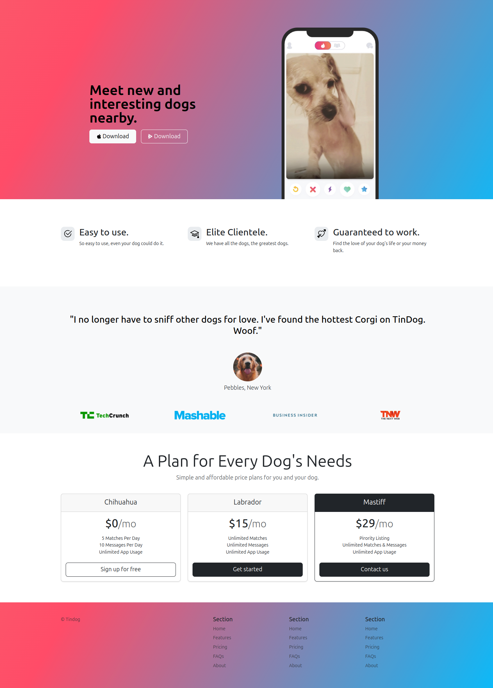

# Tin Dog

Esta é uma landing page do Tinder para cachorros, desenvolvida utilizando HTML, CSS e Bootstrap. Adicionei os snippets para inserir os elementos na página e personalizar o conteúdo, ajustando o layout e os estilos. Foi adicionada uma animação em gradiente no fundo. A página é dividida em seções, incluindo um botão para baixar o app na loja, funcionalidades, avaliações de usuários e planos de assinatura.

Para ver o projeto em execução clique <a href="https://vinimello90.github.io/TinDog/">aqui</a>.

## Recursos do projeto

- HTML5
- CSS
- bootstrap
